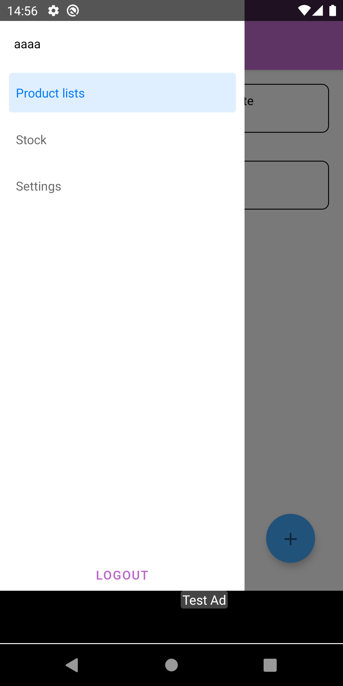

# Project Buy It

[](https://sonarcloud.io/dashboard?id=salomaoluiz_BuyIt)
[](https://sonarcloud.io/project/issues?id=salomaoluiz_BuyIt&resolved=false&types=CODE_SMELL)
[](https://sonarcloud.io/component_measures?id=salomaoluiz_BuyIt&metric=coverage&view=list)

<div style="display: flex; width: 200px">
<a href="https://www.buymeacoffee.com/salomaoluiz"></a>
</div>

This project has been created as a case study to test several development points. If you want to use this project to study and learn or for commercial purpose, feel free, as long as you follow the [LICENSE](https://github.com/salomaoluiz/BuyIt/blob/main/LICENSE) rules. Most of the project description is in Portuguese, so as to help Brazilian starter developer understand without any language barrier, but the code is written in English and will not create any hindrance in understanding the code itself.

Read this in other languages: [English](README.en.md), [Português](README.md)

## :camera: Screenshots

<div style="display:flex;" >
  
  
  
  
  
</div>

<div style="display:flex;" >
  
  
  
</div>

## Firebase
This project uses `Firebase` as a BAS (Backend as a Service), so in order to run the project, you need to configure these settings in code.

First, you need create a project in `Firebase` (Two projects if you want to separate the development environment from production environment), to configure the project for Android, add the **google-services.json** in folders *./android/app/src/development* and *./android/app/src/production*.

After that, you need to adjust the *ADMOB* for the ads, to configure this, you need to create 3 files into your root folder(where package.json is present), each file with the following information:

- **firebase.json**
```
{
  "react-native": {
    "admob_android_app_id": "APP_ID_DO_ADMOB_ANDROID",
    "admob_ios_app_id": "APP_ID_DO_ADMOB_IOS"
  }
}
```
- **.env.dev**
```
DEFAULT_ENVIRONMENT=development
ADMOB_APP_ID=ADMOB_APP_ID
ADMOB_BANNER_ID_DEFAULT=ADMOB_BANNER_ID_DEFAULT
ADMOB_BANNER_ID_CAMPAING=
ADMOB_INTERSTITIAL_ID_DEFAULT=ADMOB_INTERSTITIAL_ID_DEFAULT
ADMOB_INTERSTITIAL_ID_CAMPAING=
```

- **.env.prod**
```
DEFAULT_ENVIRONMENT=production
ADMOB_APP_ID=ADMOB_APP_ID
ADMOB_BANNER_ID_DEFAULT=ADMOB_BANNER_ID_DEFAULT
ADMOB_BANNER_ID_CAMPAING=
ADMOB_INTERSTITIAL_ID_DEFAULT=ADMOB_INTERSTITIAL_ID_DEFAULT
ADMOB_INTERSTITIAL_ID_CAMPAING=
```

> **Note:**, In spite having `ADMOB BANNER _ID_*` in the development environment, while you are using the project in development mode, it will only show test ads.

## Creating a build
To build the project, install all the dependencies using command `yarn install` after that execute `yarn android:dev` to start the app in debug mode using the development lane. To generate the app in debug mode using the production lane requires a **keystore** configured and in your *$HOME*, after configured it with the name *buyit.keystore* execute in project root `yarn android:prod`.

## After creating a build, app closes after launch, what should I do?
If you created the build following above instructions and when you launch the app in emulator/device it opens and closes immediately, go into the folder *./android* in *terminal* and execute `./gradlew clean` and try to build the app again.

## Create a build in release
To create a build in production release, you need to go to folder *./android* and execute the following command `./gradlew assembleProduction` passing the environments variable:

- `ENVFILE=.env.prod`
- `BITRISEIO_ANDROID_KEYSTORE_PASSWORD="YOUR_KEYSTORE_PASSWORD"`
- `BITRISEIO_ANDROID_KEYSTORE_ALIAS="YOUR_KEYSTORE_ALIAS"`
- `BITRISEIO_ANDROID_KEYSTORE_PRIVATE_KEY_PASSWORD="YOUR_KEYSTORE_PRIVATE_PASSWORD"`
- `BITRISE_BUILD_NUMBER="BUILD_NUMBER_DESIRED"`
- `BITRISE_VERSION_NUMBER="VERSION_NUMBER_DESIRED"`
