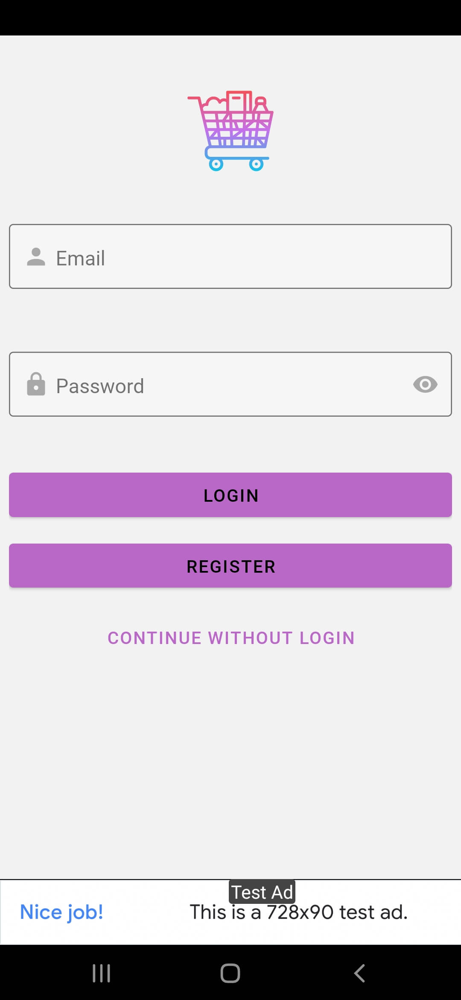
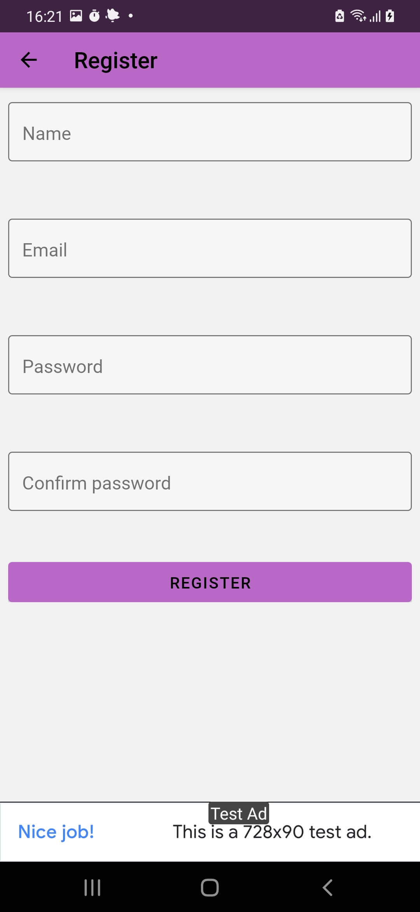
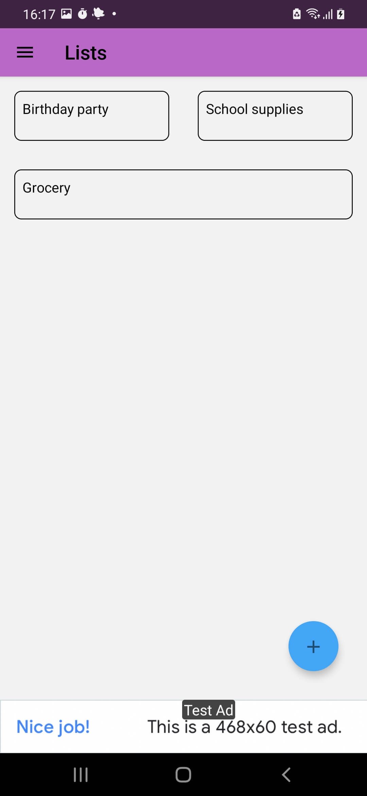
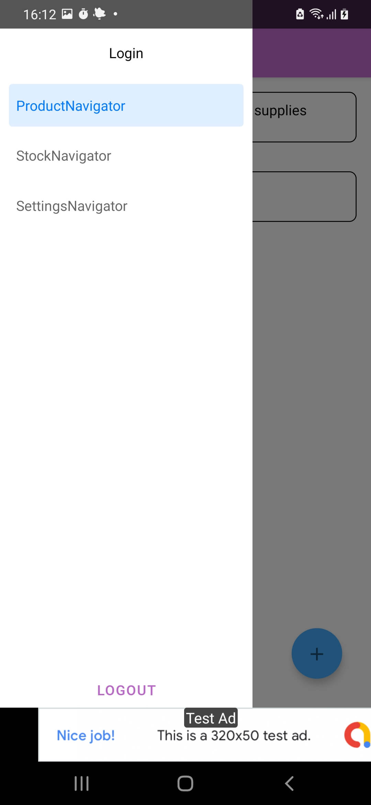
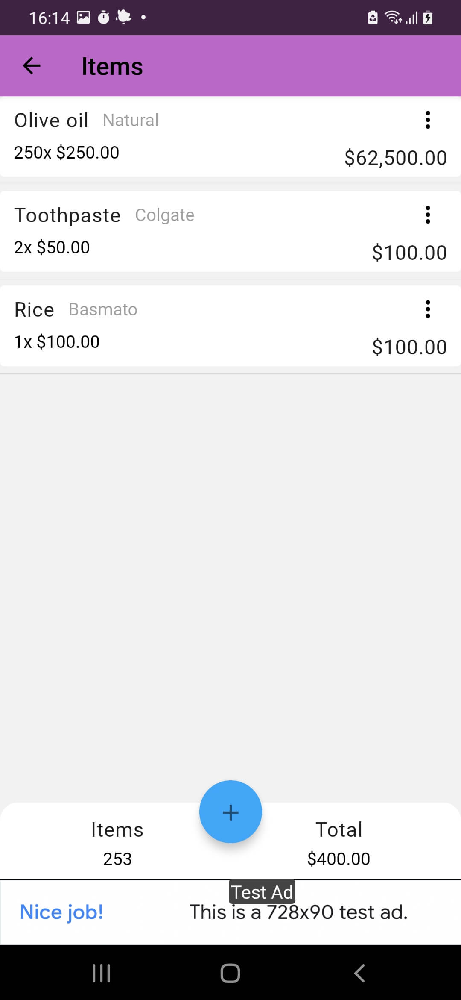
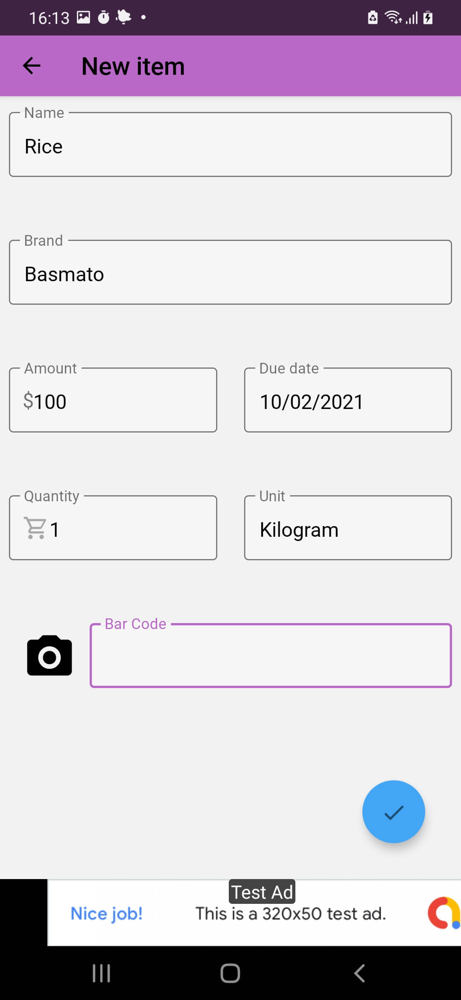
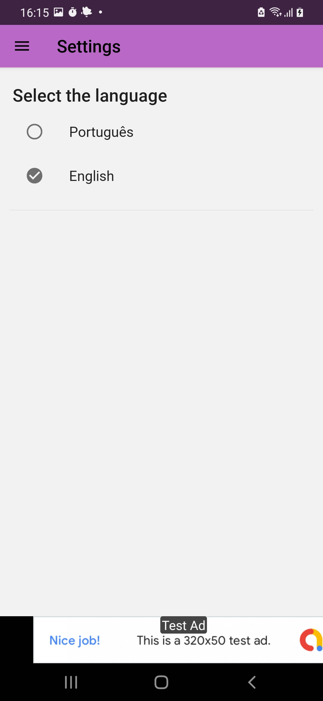
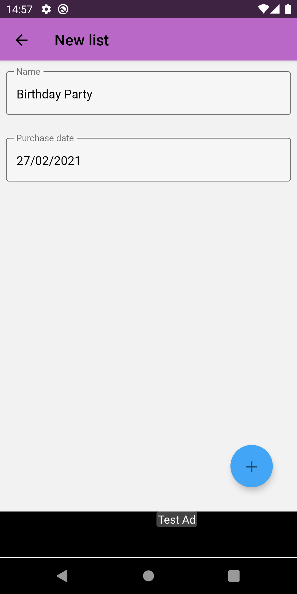

# Projeto Buy It

[](https://sonarcloud.io/dashboard?id=salomaoluiz_BuyIt)
[](https://sonarcloud.io/project/issues?id=salomaoluiz_BuyIt&resolved=false&types=CODE_SMELL)
[](https://sonarcloud.io/component_measures?id=salomaoluiz_BuyIt&metric=coverage&view=list)

<div style="display: flex; width: 200px">
<a href="https://www.buymeacoffee.com/salomaoluiz"></a>
</div>

Esse projeto foi criado como forma de estudo de caso de diversos quesitos de desenvolvimento. Caso deseje utilizar esse projeto para estudos e/ou comercialmente, fique a vontade, desde que siga as regras da [LICENSE](https://github.com/salomaoluiz/BuyIt/blob/main/LICENSE). Esse projeto está com as descrições inteiramente em português para que seja mais fácil para quem está começando na area de desenvolvimento entender os conceitos sem ter a trava da linguagem, apenas o código é inteiramente em inglês.

Read this in other languages: [English](README.en.md), [Português](README.md)

## :camera: Screenshots

<div style="display:flex;" >
  
  
  
  
  
</div>

<div style="display:flex;" >
  
  
  
</div>

## Firebase

Para esse projeto foi utilizado o Firebase como forma de BAS, logo é preciso realizar algumas configurações no projeto.

Primeiro é preciso criar um projeto no firebase (dois projetos se você deseja separar o ambiente de desenvolvimento do ambiente de produção), configurar o projeto para Android e adicionando o **google-services.json** nas pastas _./android/app/src/development_ e _./android/app/src/production_.

Após isso, é preciso criar 2 arquivos, sendo cada um deles com as seguintes informações:

- **.env.dev**

```
DEFAULT_ENVIRONMENT=development
```

- **.env.prod**

```
DEFAULT_ENVIRONMENT=production
```

## Realizando build

Para realizar o build do projeto, tenha todas as dependências instaladas usando o `yarn install` em seguida execute `yarn android:dev` para iniciar em modo debug na lane de desenvolvimento.

### Após gerar meu build ele abre e fecha o app, o que fazer?

Caso você tenha gerado um build e ao tentar abrir ele no emulador/device ele abrir e fechar o app, vá até a pasta _./android_ e execute `./gradlew clean` e tente realizar o build novamente.

## Gerar build em release

Para gerar build release na lane de desenvolvimento basta executar `fastlane release_android_development`, para realizar o deploy de produção veja a documentação [HOW_TO_DEPLOY](https://github.com/salomaoluiz/BuyIt/blob/main/fastlane/HOW_TO_DEPLOY.md)
